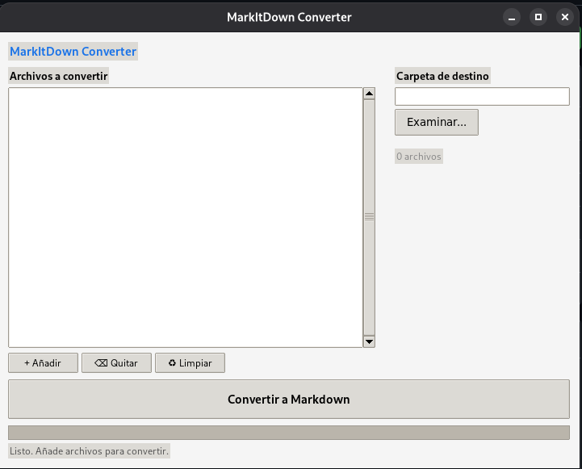

# MarkItDown UI

A graphical user interface for [Microsoft MarkItDown](https://github.com/microsoft/markitdown), the Python utility for converting various file formats to Markdown.

Convert PDF, DOCX, PPTX, XLSX, HTML, images, audio, EPUB, CSV, and many other formats — all from a simple desktop window.

---

## Features

- **Batch conversion** — select multiple files and convert them all at once
- **Per-file status** — visual feedback (pending, converting, done, error)
- **Determinate progress bar** — shows real progress (file X of Y)
- **Auto‑generated output filenames** — `report.pdf` → `report.md` (editable per file)
- **Desktop integration** — `.deb` package installs a launcher and menu entry

## Screenshot



---

## Quick Start

### Option 1 — Install via `.deb` (Debian / Ubuntu)

Download the latest `.deb` from the [Releases](https://github.com/YamithR/MarkItDown-UI/releases) page, then:

```bash
sudo dpkg -i markitdown-gui_*.deb
sudo apt install -f
```

The package automatically installs `markitdown[all]` via pip during installation. Internet connection is required for the pip step.

Launch from the applications menu or via:

```bash
markitdown-gui
```

### Option 2 — Run from source

```bash
git clone https://github.com/YamithR/MarkItDown-UI.git
cd MarkItDown-UI

pip install "markitdown[all]"
python3 src/markitdown_ui/gui.py
```

Or as a module:

```bash
python3 -m markitdown_ui
```

---

## Dependencies

| Dependency | Source |
|-----------|--------|
| Python ≥ 3.10 | apt (`python3`) |
| Tkinter | apt (`python3-tk`) |
| [MarkItDown](https://github.com/microsoft/markitdown) + all extras (`pdf`, `docx`, `pptx`, `xlsx`, `xls`, `outlook`, `audio-transcription`, `youtube-transcription`, `az-doc-intel`, `az-content-understanding`) | pip (`markitdown[all]`) |

The `.deb` package pulls in `python3`, `python3-tk`, and `python3-pip` via apt, then the `postinst` script runs `pip3 install "markitdown[all]"` to get everything else.

---

## Build the `.deb` yourself

```bash
# Install build dependencies
sudo apt install python3-tk python3-pip python3-pil
pip install "markitdown[all]"

# Clone and build
git clone https://github.com/YamithR/MarkItDown-UI.git
cd MarkItDown-UI
bash build-deb.sh

# Install the resulting package
sudo dpkg -i dist/markitdown-gui_*.deb
sudo apt install -f
```

---

## Project Structure

```
MarkItDown-UI/
├── README.md
├── LICENSE
├── .gitignore
├── build-deb.sh              # Build the .deb package
├── dist/
│   └── markitdown-gui_*.deb  # Pre-built .deb (also in Releases)
└── src/
    └── markitdown_ui/
        ├── __init__.py
        ├── __main__.py        # python3 -m markitdown_ui
        └── gui.py             # Tkinter GUI application
```

---

## Credits

This GUI is a complementary front‑end for the excellent **[Microsoft MarkItDown](https://github.com/microsoft/markitdown)** library, created by Adam Fourney and contributors. All file conversion logic is handled by the upstream project.

- Original project: [https://github.com/microsoft/markitdown](https://github.com/microsoft/markitdown)
- License: MIT (same as the original)

---

## License

MIT License. See [LICENSE](LICENSE).
