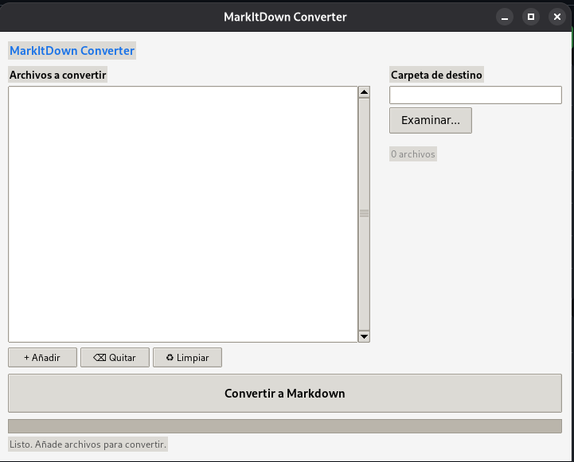

# MarkItDown UI

A cross-platform desktop app for [Microsoft MarkItDown](https://github.com/microsoft/markitdown), the Python utility that converts files to Markdown — with **fully offline OCR** (EasyOCR / Tesseract), drag & drop, batch conversion and **no cloud dependencies, no AI APIs**.

Convert PDF, DOCX, PPTX, XLSX, HTML, images, audio, EPUB, CSV, and many other formats — all **100% local**.

---

## Features

- **Electron desktop app** (HTML/JS) with a headless Python backend (JSONL subprocess)
- **Offline OCR (no AI, no APIs)** — three-tier backend, auto-selected:
  - **EasyOCR** (best quality, 80+ languages, CPU or GPU)
  - **Tesseract** (fast, lightweight)
  - **MarkItDown built-in** (zero extra dependencies)
- **OCR ON by default** — auto-detects your system language (es/en)
- **Scanned PDF detection** — pages without a text layer are rendered and OCR'd page by page
- **Image OCR** — JPG/PNG/TIFF/WEBP/BMP/GIF get direct OCR, wrapped in `*[Image OCR]...*` blocks
- **Batch conversion** — drag & drop or browse multiple files
- **Per-file status + size + OCR indicator**, determinate progress bar
- **EN/ES language switching** in the app UI
- **CLI / headless mode** — batch folders, recursive scan, dry-run, extension filters
- **Conversion history** — JSONL log at `~/.markitdown-ui/history.jsonl`
- **Windows** nsis + portable `.exe`, **Linux** `.deb` + AppImage

## Screenshot



---

## Quick Start

### Option 1 — Desktop app (Windows / Linux)

Download `MarkItDown-UI-<version>-Setup.exe` (or the portable `.exe`) from the [Releases](https://github.com/YamithR/MarkItDown-UI/releases) page. Linux users get `.deb` / AppImage packages. Releases bundle the Python backend and, by default, the EasyOCR models — OCR works offline out of the box.

### Option 2 — Run from source (Electron app)

```bash
git clone https://github.com/YamithR/MarkItDown-UI.git
cd MarkItDown-UI

# Python backend (needs a venv to avoid global install)
python3 -m venv .venv && source .venv/bin/activate
python -m pip install -r requirements.txt

# Electron app
cd app
npm install
npm start
```

The app spawns the backend automatically (`python3 -m markitdown_ui --server`) and talks JSONL over stdin/stdout.

### Option 3 — CLI only

```bash
# Convert files/folders to the current directory
python3 -m markitdown_ui document.pdf report.xlsx

# Batch convert a folder recursively into ./out (with OCR)
python3 -m markitdown_ui ./docs -o ./out -r

# Only PDFs and DOCX, overwrite existing outputs
python3 -m markitdown_ui ./docs -o ./out --include pdf docx --overwrite

# Preview what would happen without writing anything
python3 -m markitdown_ui ./docs --dry-run

# OCR options
python3 -m markitdown_ui image.png -o . --ocr-lang en es --backend "EasyOCR (en, es)"
python3 -m markitdown_ui --list-backends
```

---

## Dependencies

| Dependency | Purpose | Install |
|-----------|---------|---------|
| Python ≥ 3.10 | backend runtime | apt / python.org |
| [MarkItDown](https://github.com/microsoft/markitdown)[all] | conversion engine | `pip install "markitdown[all]"` |
| PyMuPDF | PDF page rendering for scanned OCR | `pip install PyMuPDF` |
| Pillow | image handling | `pip install Pillow` |
| pytesseract | Tesseract OCR backend | `pip install pytesseract` (+ `tesseract-ocr` system package) |
| easyocr + torch | high-quality offline OCR, 80+ languages (optional, ~1.5 GB; bundled into releases by default) | `pip install easyocr` |
| Node ≥ 20 + Electron | desktop UI | `npm install` in `app/` |

All conversion and OCR runs **100% locally**. No API keys, no telemetry, no uploads.

---

## Architecture

```
MarkItDown-UI/
├── app/                        # Electron desktop app
│   ├── main.js                 # Main process: spawns backend, IPC bridge
│   ├── preload.js              # contextBridge (secure IPC surface)
│   ├── package.json            # electron-builder config
│   ├── assets/                 # app icon (ico/png)
│   └── renderer/               # HTML/CSS/JS UI
│       ├── index.html
│       ├── styles.css
│       ├── renderer.js
│       └── i18n.js             # EN/ES strings
├── backend/                    # Headless Python backend
│   ├── markitdown_ui/
│   │   ├── __init__.py
│   │   ├── __main__.py         # python3 -m markitdown_ui
│   │   ├── cli.py              # CLI + system-language detection
│   │   ├── server.py           # JSONL server mode (stdin/stdout)
│   │   ├── ocr_backends.py     # EasyOCR / Tesseract / Builtin backends
│   │   └── ocr_manager.py      # Backend auto-detection & selection
│   └── backend.spec            # PyInstaller config (onedir -> backend/)
├── entrypoint.py               # Frozen backend entry point
├── legacy/                     # Old Tkinter GUI (kept as reference, not built)
└── .github/workflows/build.yml # CI: PyInstaller backend + electron-builder,
                                # publishes GitHub Releases on v* tags
```

**JSONL protocol** — one JSON object per line on stdin/stdout:

```
→ {"id": 1, "cmd": "convert", "paths": ["a.pdf"], "output": "out/", "ocr": {...}}
← {"type": "ack", "id": 1}
← {"type": "batch_start", "id": 1, "total": 1}
← {"type": "file_status", "id": 1, "file": "a.pdf", "status": "converting"}
← {"type": "file_done", "id": 1, "file": "a.pdf", "status": "ok", "output": "out/a.md"}
← {"type": "progress", "id": 1, "current": 1, "total": 1, "pct": 100.0}
← {"type": "batch_done", "id": 1, "ok": 1, "err": 0}
```

---

## Build from source

### Linux (deb + AppImage)

```bash
python3 -m venv .venv && source .venv/bin/activate
pip install -r requirements.txt pyinstaller
python -m PyInstaller --noconfirm --clean --distpath backend/dist --workpath backend/build backend/backend.spec
cd app && npm install
# optional (bundles EasyOCR): pip install easyocr torch torchvision --index-url https://download.pytorch.org/whl/cpu
npx electron-builder --linux deb AppImage
# artifacts in app/release/
```

### Windows (NSIS + portable exe)

```powershell
py -m venv .venv; .\.venv\Scripts\Activate.ps1
pip install -r requirements.txt pyinstaller
py -m PyInstaller --noconfirm --clean --distpath backend/dist --workpath backend/build backend/backend.spec
cd app; npm install
# optional: pip install easyocr torch torchvision --index-url https://download.pytorch.org/whl/cpu
npx electron-builder --win nsis portable
```

Alternatively, push a `v*` tag and GitHub Actions builds both platforms and attaches the packages to a Release automatically (OCR bundled by default).

---

## Project Structure (legacy references)

The old Tkinter GUI (`gui.py`, `build-*.sh/ps1`, `markitdown-ui-tkinter.spec`) lives in `legacy/`. The 2.0 architecture is Electron + headless backend; the Tkinter app is not built for releases anymore.

---

## Credits

This project is a front‑end for the excellent **[Microsoft MarkItDown](https://github.com/microsoft/markitdown)** library, created by Adam Fourney and contributors. All file conversion logic is handled by the upstream project. OCR backends: [EasyOCR](https://github.com/JaidedAI/EasyOCR) and Tesseract.

---

## License

MIT License. See [LICENSE](LICENSE).